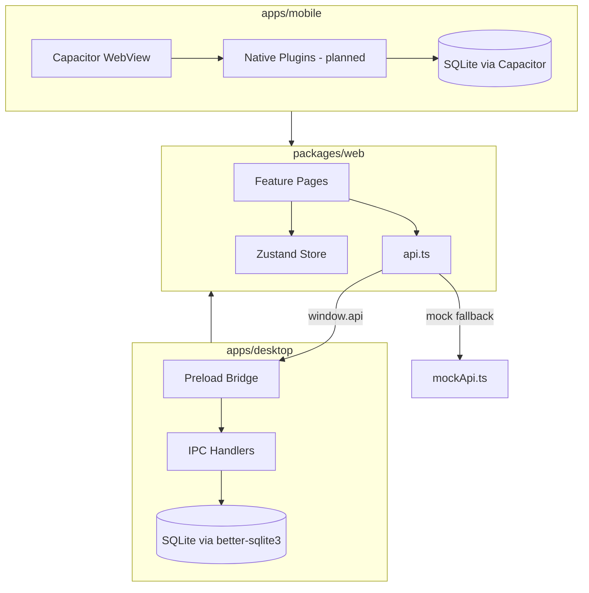
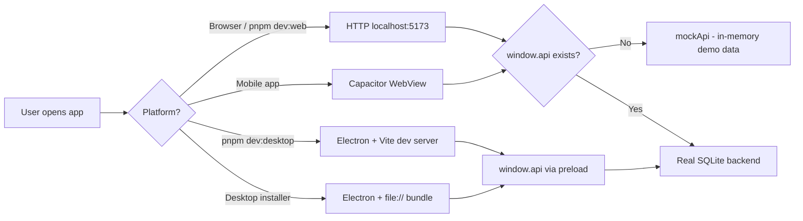
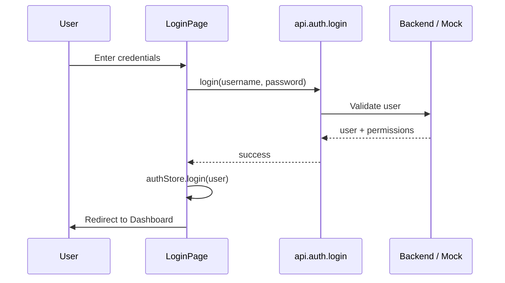
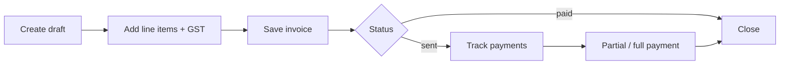

# Borewell ERP — Documentation

Technical documentation for the monorepo: shared UI, desktop shell, and mobile shell.

| Document | Description |
|----------|-------------|
| [UI (Web)](./ui.md) | Shared React app — routes, modules, API layer, state |
| [Desktop](./desktop.md) | Electron app — startup, IPC, database, build |
| [Mobile](./mobile.md) | Capacitor app — sync, Android/iOS workflow |

## Monorepo overview

One React UI (`packages/web`) runs inside two native shells:

```
packages/web          ← shared UI (React + Vite)
       │
       ├── apps/desktop   ← Electron + better-sqlite3 + IPC
       └── apps/mobile    ← Capacitor + SQLite plugin (planned bridge)
```

Shared packages used by all layers:

| Package | Role |
|---------|------|
| `@borewell/web` | React UI, pages, components |
| `@borewell/core` | GST math, validation, business rules |
| `@borewell/database` | Schema, migrations, bootstrap, seed |
| `@borewell/config` | Shared TypeScript configs |

## End-to-end architecture



## Runtime modes



## Common user flows

### Login



### Invoice lifecycle



## Quick commands

| Goal | Command |
|------|---------|
| Web UI only (mock data) | `pnpm dev:web` |
| Desktop dev (real DB) | `pnpm dev:desktop` |
| Desktop installer | `pnpm build:desktop` |
| Mobile sync | `pnpm --filter @borewell/mobile build` |
| Typecheck all | `pnpm typecheck` |

Default login: **admin / admin123**

## Data locations

| Platform | Database | Logs |
|----------|----------|------|
| Desktop (Windows) | `%APPDATA%/@borewell/desktop/BorewellERP/database/borewell.db` | `<exe-dir>/app_logs/` |
| Web dev | None (mock) | Browser console |
| Mobile | Device-local SQLite (when bridge is wired) | Platform logs |
