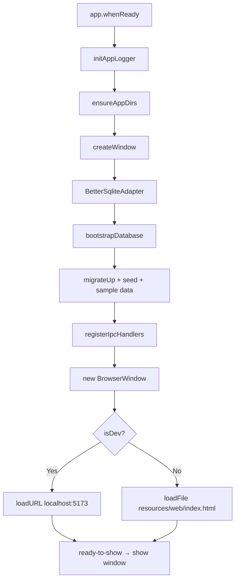
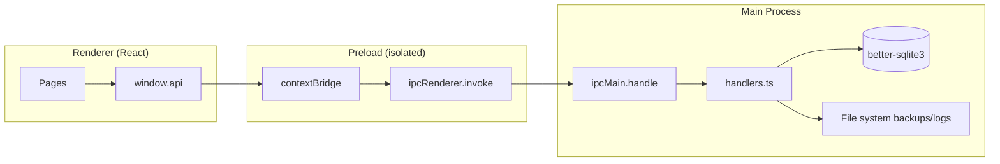
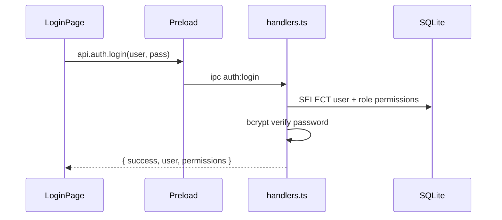
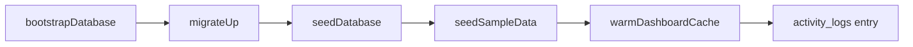
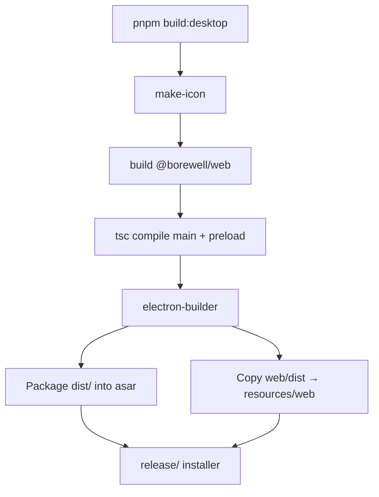
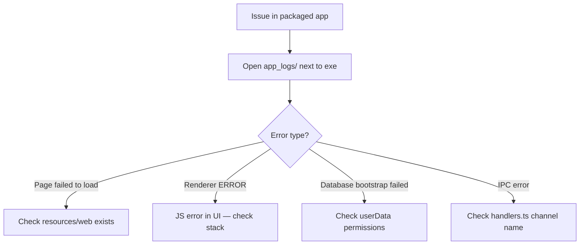

# Desktop Documentation (`apps/desktop`)

Electron shell for Windows, macOS, and Linux. Hosts the shared React UI and provides SQLite access through a secure IPC bridge.

## Purpose

- Run the ERP fully offline with a local SQLite database
- Expose database and file operations to the UI via `window.api`
- Package as a single installer (NSIS on Windows, DMG on macOS, AppImage/deb on Linux)

## Folder structure

```
apps/desktop/
├── assets/                 # App icons (png, ico)
├── scripts/make-icon.mjs   # Generates .ico for Windows builds
├── src/
│   ├── main/
│   │   ├── index.ts        # App entry, window creation
│   │   ├── paths.ts        # Data dirs, web bundle path
│   │   ├── logger.ts       # File logging (7-day retention)
│   │   ├── database/
│   │   │   └── adapter.ts  # better-sqlite3 adapter
│   │   └── ipc/
│   │       ├── handlers.ts # All IPC handlers + DB init
│   │       └── invoiceFields.ts
│   └── preload/
│       └── index.ts        # contextBridge → window.api
├── dist/                   # Compiled main + preload (tsc output)
└── release/                # electron-builder output
```

## Startup flow



## Production vs development

| Aspect | Development | Production |
|--------|-------------|------------|
| UI source | Vite dev server `:5173` | Bundled `resources/web/` |
| Load method | `loadURL()` | `loadFile()` |
| Router (UI) | BrowserRouter | HashRouter |
| DevTools | Open automatically | Closed |
| `app.isPackaged` | false | true |

## IPC architecture



Security settings:
- `contextIsolation: true`
- `nodeIntegration: false`
- Preload is the only bridge between UI and Node

## IPC channels

| Channel | Purpose |
|---------|---------|
| `auth:login` | User authentication |
| `dashboard:*` | KPIs, charts, refresh |
| `clients:*` | Client CRUD |
| `invoices:*` | Invoice CRUD + status |
| `payments:*` | Payment CRUD |
| `borewell:*` | Borewell job CRUD |
| `vehicles:*` | Vehicle CRUD |
| `expenses:*` | Expense CRUD |
| `gst:summary` | GST reports |
| `settings:*` | App settings |
| `backup:*` | Create, list, restore |
| `audit:getLogs` | Audit trail |
| `users:*` / `roles:list` | User management |
| `logs:*` / `app:writeLog` | Application logging |
| `app:getInfo` | Version, paths, platform |

## Auth flow



## Database bootstrap

On every launch (first run creates DB):



Uses `@borewell/database` — same migrations as CLI (`pnpm db:migrate`).

## Data paths (Windows)

| Path | Location |
|------|----------|
| User data root | `%APPDATA%/@borewell/desktop/BorewellERP/` |
| Database | `.../BorewellERP/database/borewell.db` |
| Backups | `.../BorewellERP/backups/` |
| Exports | `.../BorewellERP/exports/` |
| Invoice PDFs | `.../BorewellERP/invoices/pdf/` |
| App logs | `<install-dir>/app_logs/application-YYYY-MM-DD.txt` |

Logs are written next to the executable (not in AppData). Retention: **7 days**.

## Build flow



Output:
- Windows: `apps/desktop/release/Borewell ERP Setup 1.0.0.exe`
- Unpacked: `apps/desktop/release/win-unpacked/Borewell ERP.exe`

## Development

```bash
pnpm dev:desktop
```

This runs:
1. Build `@borewell/database` and `@borewell/core`
2. Start Vite dev server (`@borewell/web`)
3. Wait for `:5173`, compile TypeScript, launch Electron

Default login: **admin / admin123**

## Logging & troubleshooting



From Settings page you can also open today's log file via `api.logs.openToday()`.

## Native dependencies

- **better-sqlite3** — rebuilt on install via `electron-builder install-app-deps`
- **bcryptjs** — password hashing

## Adding a new IPC endpoint

1. Add handler in `src/main/ipc/handlers.ts`
2. Expose in `src/preload/index.ts`
3. Extend `ApiClient` in `packages/web/src/services/api.ts`
4. Add mock implementation in `mockApi.ts`
5. Use from UI via `api.yourDomain.method()`
