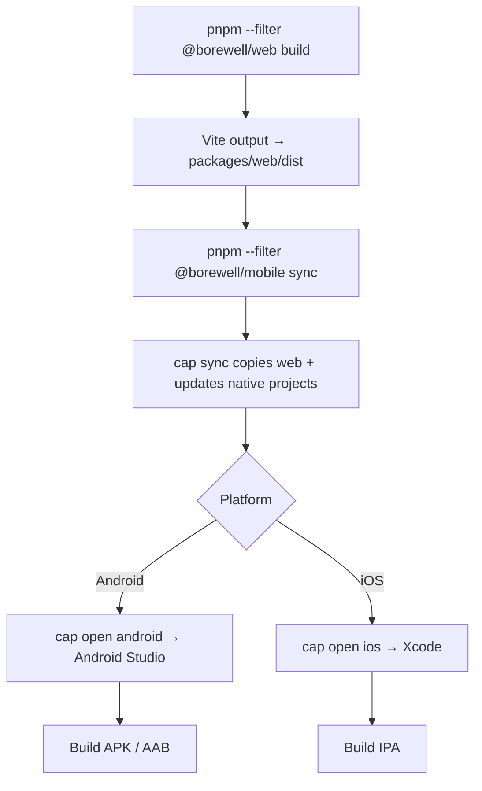
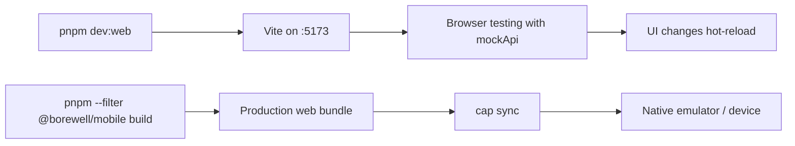
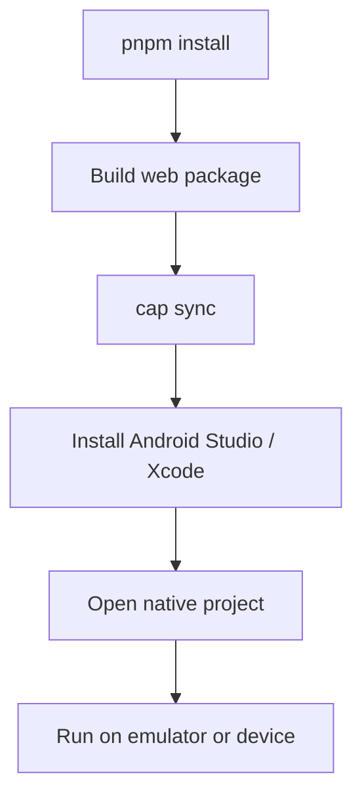

# Mobile Documentation (`apps/mobile`)

Capacitor shell for Android and iOS. Wraps the same React UI from `packages/web` in a native WebView.

## Purpose

- Ship Borewell ERP on phones and tablets
- Reuse 100% of the shared UI (`packages/web`)
- Target offline SQLite via `@capacitor-community/sqlite` (plugin configured; native bridge in progress)

## Folder structure

```
apps/mobile/
├── capacitor.config.ts   # App ID, webDir, SQLite plugin config
├── package.json            # Capacitor scripts + plugins
├── android/                # Generated after cap sync (not in repo until sync)
└── ios/                    # Generated after cap sync
```

The UI lives in `packages/web/dist` — Capacitor serves that folder inside the native WebView.

## Current vs target runtime

| Capability | Desktop | Mobile (today) | Mobile (target) |
|------------|---------|----------------|-----------------|
| Shared UI | Yes | Yes | Yes |
| Real SQLite | Yes (IPC) | No — uses mockApi | Yes (Capacitor SQLite) |
| Offline | Yes | Partial (UI only) | Yes |
| Native bridge | preload / window.api | Not wired yet | Capacitor plugin bridge |

When `window.api` is absent, the UI automatically uses `mockApi.ts` (same as browser dev mode).

## Capacitor configuration

```ts
// capacitor.config.ts
appId:   "com.borewell.erp"
appName: "Borewell ERP"
webDir:  "../../packages/web/dist"
server:  { androidScheme: "https" }   // Required for secure WebView APIs
plugins: { CapacitorSQLite: { ... } }
```

## Build & deploy flow



## Development flow



For day-to-day UI work, use `pnpm dev:web` in a browser. Use the mobile build path when testing layout on devices or preparing store builds.

## Commands

| Command | Description |
|---------|-------------|
| `pnpm --filter @borewell/mobile dev` | Starts Vite dev server (same as web dev) |
| `pnpm --filter @borewell/mobile build` | Build web + `cap sync` |
| `pnpm --filter @borewell/mobile sync` | Sync web assets to native projects |
| `pnpm --filter @borewell/mobile open:android` | Open Android Studio |
| `pnpm --filter @borewell/mobile open:ios` | Open Xcode (macOS only) |

### Full mobile build (from repo root)

```bash
pnpm --filter @borewell/web build
pnpm --filter @borewell/mobile sync
pnpm --filter @borewell/mobile open:android
```

## First-time setup



Prerequisites:
- Node.js 20+, pnpm 9+
- **Android**: Android Studio, SDK, Java 17+
- **iOS** (macOS only): Xcode, CocoaPods

## Planned native bridge architecture

```mermaid
flowchart TB
  subgraph WebView["Capacitor WebView"]
    UI[React UI] --> API[api.ts]
  end

  subgraph Bridge["Future: mobile bridge"]
    API --> CAP[window.api shim]
    CAP --> SQL[CapacitorSQLite plugin]
  end

  subgraph Device["Device storage"]
    SQL --> DB[(borewell.db)]
  end

  subgraph Shared["Shared packages"]
    DB --> MIG[@borewell/database migrations]
    UI --> CORE[@borewell/core business logic]
  end
```

Target: implement a Capacitor plugin wrapper that exposes the same `window.api` interface as Electron preload, reusing `@borewell/database` bootstrap and `@borewell/core` validation.

## Routing on mobile

Capacitor uses `https://localhost` scheme (Android). The UI uses **BrowserRouter** in this mode (not `file://`), so hash routing is not required on mobile.

## Plugins in use

| Plugin | Purpose |
|--------|---------|
| `@capacitor/core` | Capacitor runtime |
| `@capacitor/android` / `@capacitor/ios` | Native platforms |
| `@capacitor/app` | App lifecycle events |
| `@capacitor/filesystem` | File read/write for exports |
| `@capacitor-community/sqlite` | Local SQLite database |

## Testing checklist

- [ ] UI renders on Android emulator
- [ ] UI renders on iOS simulator
- [ ] Login page displays (mock auth works)
- [ ] Sidebar navigation works on small screens
- [ ] Forms usable with touch keyboard
- [ ] SQLite bridge connected (future)
- [ ] Backup/export via Filesystem plugin (future)

## Troubleshooting

| Problem | Fix |
|---------|-----|
| Blank WebView after sync | Re-run `pnpm --filter @borewell/web build` then `cap sync` |
| `webDir` not found | Ensure `packages/web/dist` exists before sync |
| Android build fails | Open Android Studio, sync Gradle, check SDK version |
| Data not persisting | Expected until SQLite bridge is implemented — currently mockApi |
| Stale UI on device | Clean build web + `cap sync` + rebuild native app |

## Related docs

- [UI documentation](./ui.md) — pages, routes, API layer
- [Desktop documentation](./desktop.md) — reference IPC/API design for mobile bridge
