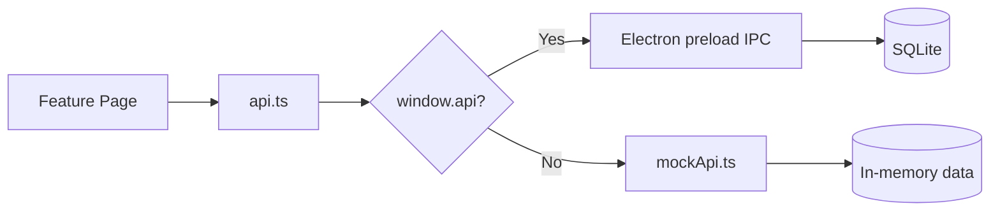
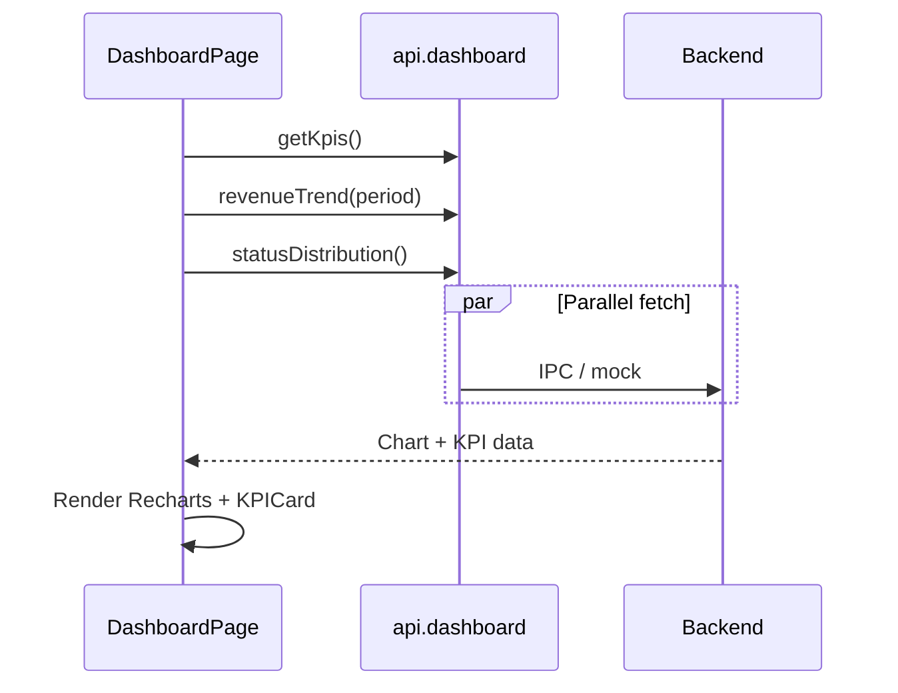
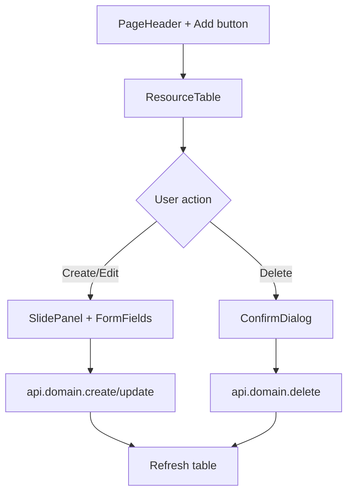
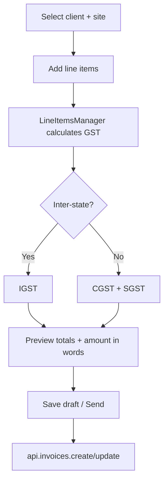

# UI Documentation (`packages/web`)

Shared React 19 front-end used by desktop and mobile shells. Built with Vite, TailwindCSS 4, and Zustand.

## Purpose

Single UI codebase for all ERP screens: billing, borewell jobs, GST, analytics, settings, and admin. Talks to the real database through `window.api` (Electron) or falls back to `mockApi` for browser-only development.

## Folder structure

```
packages/web/
├── index.html              # Entry HTML
├── vite.config.ts          # Vite + Tailwind; base: "./" for file:// builds
└── src/
    ├── main.tsx            # React bootstrap + renderer logging
    ├── App.tsx             # Router + route definitions
    ├── index.css           # Tailwind theme tokens
    ├── store/              # Zustand (auth, theme, layout)
    ├── services/
    │   ├── api.ts          # API client selector (real vs mock)
    │   └── mockApi.ts      # In-memory demo backend
    ├── lib/                # Utils, constants, invoice print, logging
    ├── hooks/              # Shared React hooks
    ├── components/
    │   ├── layout/         # AppShell, CommandPalette
    │   ├── crud/           # ResourceTable, SlidePanel, forms helpers
    │   ├── dashboard/      # KPI cards
    │   ├── invoice/        # Line items, GST line editor
    │   └── ui/             # Button, Input, DataTable
    └── modules/            # Feature pages (one folder per domain)
        ├── auth/
        ├── dashboard/
        ├── clients/
        ├── invoices/
        ├── payments/
        ├── borewell/
        ├── vehicles/
        ├── expenses/
        ├── gst/
        ├── analytics/
        ├── settings/
        ├── users/
        └── backup/
```

## Routing

Uses **BrowserRouter** in dev/HTTP and **HashRouter** when loaded via `file://` (packaged Electron).

| Route | Page | Description |
|-------|------|-------------|
| `/login` | LoginPage | Public login |
| `/` | DashboardPage | KPIs and charts |
| `/clients` | ClientsPage | Client CRUD |
| `/invoices` | InvoicesPage | Invoice list |
| `/invoices/new` | InvoiceFormPage | Create invoice |
| `/invoices/:id` | InvoiceDetailPage | View / print |
| `/invoices/:id/edit` | InvoiceFormPage | Edit invoice |
| `/payments` | PaymentsPage | Payment tracking |
| `/borewell-jobs` | BorewellJobsPage | Drilling jobs |
| `/vehicles` | VehiclesPage | Fleet management |
| `/expenses` | ExpensesPage | Expense tracking |
| `/gst` | GstReportsPage | GST summaries |
| `/analytics` | AnalyticsPage | Borewell analytics |
| `/logs` | LogsPage | Audit log viewer |
| `/settings` | SettingsPage | Company + app settings |
| `/users` | UsersPage | User management |
| `/backup` | BackupPage | Backup / restore |

## Navigation flow

```mermaid
flowchart TD
  Start([App load]) --> Auth{isAuthenticated?}
  Auth -->|No| Login[/login]
  Auth -->|Yes| Shell[AppShell layout]
  Login -->|Success| Shell
  Shell --> Nav{Sidebar / Cmd+K}
  Nav --> Dashboard
  Nav --> Clients
  Nav --> Invoices
  Nav --> Payments
  Nav --> Other[Other modules...]
  Shell -->|Logout| Login
```

## API layer



Every page imports `api` from `@/services/api`. The same interface works in all environments:

```ts
import { api } from "@/services/api";
const clients = await api.clients.list();
```

Key API domains: `auth`, `dashboard`, `clients`, `invoices`, `payments`, `borewell`, `vehicles`, `expenses`, `gst`, `settings`, `backup`, `audit`, `users`, `roles`, `branches`, `logs`, `app`.

## State management

| Store | Persisted | Purpose |
|-------|-----------|---------|
| `useAuthStore` | Yes (`borewell-auth`) | User session, permissions |
| `useThemeStore` | Yes (`borewell-theme`) | light / dark / system |
| `useAppStore` | No | Sidebar collapse, command palette |

## Page → API flow (example: Dashboard)



## CRUD page pattern

Most list pages follow the same structure:



Shared CRUD components: `PageHeader`, `ResourceTable`, `SlidePanel`, `ConfirmDialog`, `RowActions`, `StatusPill`.

## Invoice form flow



Uses `@borewell/core` for GST calculations and amount-in-words.

## Development

```bash
pnpm dev:web          # http://localhost:5173 — mock API
pnpm --filter @borewell/web build   # Production bundle → dist/
pnpm --filter @borewell/web typecheck
```

| Mode | API source | Router |
|------|------------|--------|
| `pnpm dev:web` | mockApi | BrowserRouter |
| `pnpm dev:desktop` | window.api (IPC) | BrowserRouter |
| Packaged desktop | window.api (IPC) | HashRouter |

## Key dependencies

| Library | Use |
|---------|-----|
| react-router-dom | Routing |
| zustand | Client state |
| recharts | Dashboard / analytics charts |
| framer-motion | Page transitions |
| @tanstack/react-table | Data tables |
| sonner | Toast notifications |
| cmdk | Command palette (Ctrl+K) |
| lucide-react | Icons |

## Adding a new screen

1. Create `src/modules/<feature>/<Feature>Page.tsx`
2. Add route in `App.tsx` inside `ProtectedRoute`
3. Add nav item in `AppShell.tsx` and `CommandPalette.tsx`
4. Extend `api.ts` interface + `mockApi.ts`
5. Add IPC handler in `apps/desktop` (for real data on desktop)
